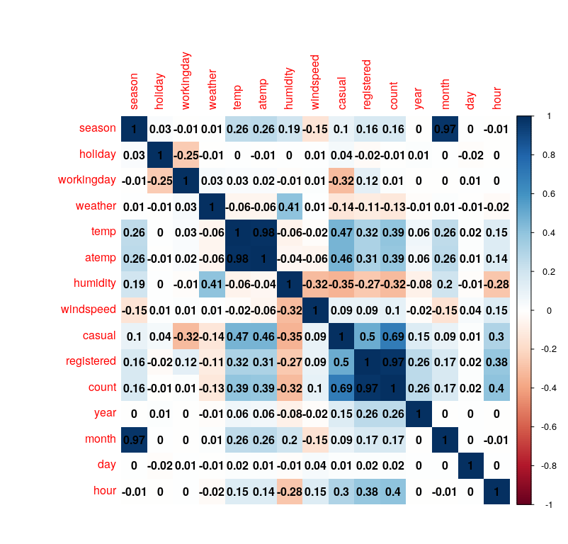
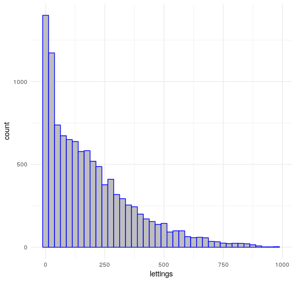
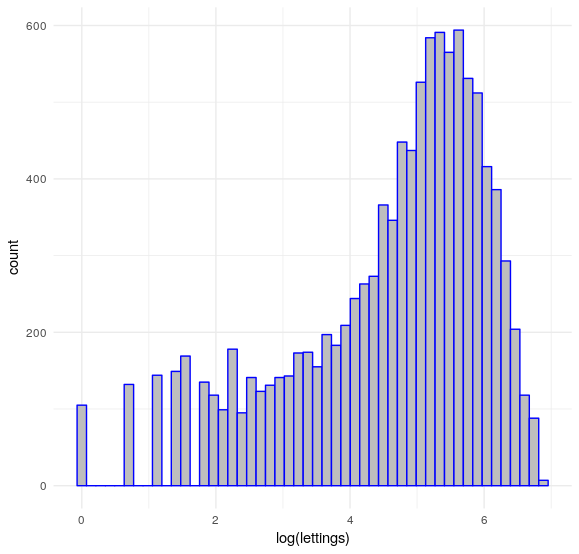

# Top 10% solution for [Bike Sharing Demand kaggle challange](https://www.kaggle.com/c/bike-sharing-demand) with [xgboost](https://xgboost.readthedocs.io/en/latest/)

After we look at the dataset we can see that we have a datetime column, which we are going to separate to individual columns, such as year, month, day, hour. Furthermore to not leak solutions we get rid of the casual, registered columns and due to the high correlation we remove the month column also.

| Correlation plot |
|------------------|
|  |

Lastly when we look at the count(=lettings) histogram we can see that it is a skewed distribution, thus we might look for a transformation to bring it closer to the normal distribution.

| Skew distribution | Log transformed distribution |
|-------------------|------------------------------|
|  |  |

I used grid search to tune the L1 and L2 regularization of the xgboost using 5-fold cross-validation.

To improve the predictions of the model as we do know that the counts are integers we round up to integers our regression predictions. This approach results in 0.40517 root mean squared logarithmic error putting the analysis in the top 10%. The R code can be viewed [here](https://github.com/eugeniodintino/xgboost_bike_demand/blob/master/xgboost.R).

Further improvements could be done by looking for outliers in the training dataset or to tune the other parameters of xgboost.
